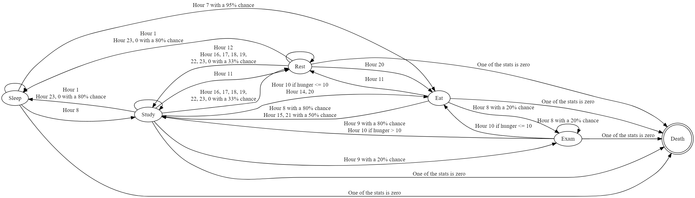

# Finite-state-machine

This program describes a finite state machine model that simulates the day of a computer science student.

## Installation

Copy the repository, then run the fsm.py file
You can also specify the verbosity and speed of state changes when the program starts.

## Description

This machine has 6 states:

- Sleep
- Eat
- Study
- Exam
- Rest
- Death (final state)

The machine also has three main attributes: **hunger**, **energy**, **and mood**. States affect the change of these attributes, and the attributes themselves affect the change of states.

If one of the attributes reaches 0, the machine enters the death state and terminates its operation.

Random events also affect the change of attribute states and values:

- Sleeping through breakfast - **5% chance**
- Wake up in a bad mood - **10% chance**
- Exam - **20% chance**
  - Fail or pass the exam - **50% chance**
- Forgetting to buy food - **2% chance**
- Don't eat when you're in a bad mood - **20% chance**
- Stop studying and start resting (and vice versa) - **33% chance**
- Decide to go to bed later - **20% chance**

State diagram for a finite state machine:

Also you can look at svg version in graph folder.
